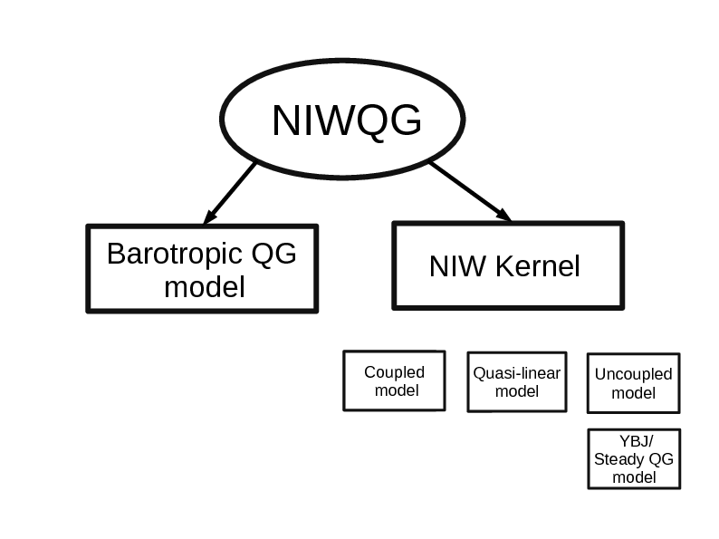

Code for a special class of solutions of the Xie & Vanneste (2015) coupled model in a doubly periodic domain –– the documentation is in the works.



# Installation
This software is written in `python3` and depends on `numpy` and `h5py`. I strongly
recommend the python3 pre-packaged on [Anaconda](https://www.continuum.io/downloads).
This package comes with `numpy`. To install h5py, use Anaconda's package manager:
```bash
conda install h5py
```

For a more comprehensive installation or update with conda use
```
make install
```

### Installing `niwqg`

If you're a git user, fork and clone your fork of the `niwqg` repository.
Alternatively, just download the repository by clicking on the link on the
upper-right corner of this page.

Inside the root niwqg directory, install the package:

```bash
python setup.py install
```

If you plan to make changes to the code, then setup the development mode:

```bash
python setup.py develop
```

### Testing `niwqg`
If you have [`pytest`](https://docs.pytest.org/en/latest/), then run
```
make test
```
Alternatively, to in the test directory
```bash
cd niwqg/tests
```
and run all unit tests using nose:
```bash
nosetests
```

You can also run this simple [example](./examples/LambDipole_CoupledModel.ipynb)
and verify the energy budget.

# Development
The code is under rapid development by [@crocha700](https://github.com/crocha700)
as part of the project "Stimulated Loss of Balance" (SLOB) with
[@glwagner](https://github.com/glwagner) and [@wry55](https://github.com/wry55).

Please, submit contributions via pull-request of
a cut-off branch (not master). the PR must include the
output of the test suite.

# Funding
This project is funded by the [National Aeronautics and Space Administration](https://www.nasa.gov) under grant NNX16AO5OH.
